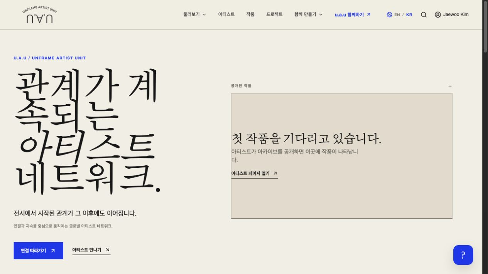
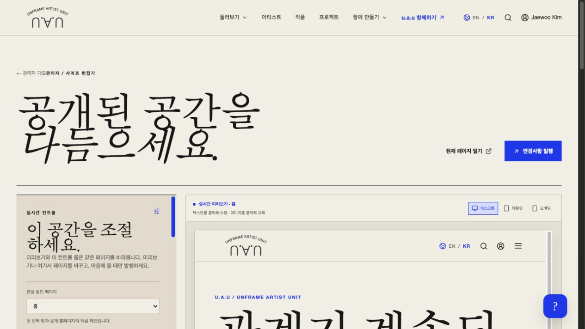
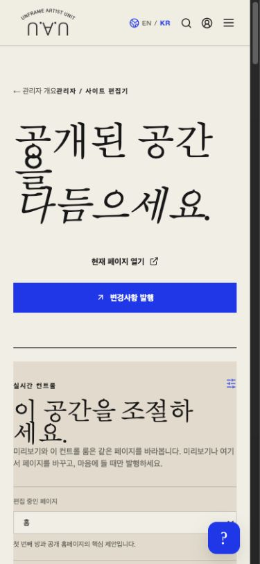

# u.a.u 운영·기능·디자인 개선 방향

검토일: 2026-09-23 · 기준 커밋: 1d69259

## 판단

u.a.u는 고유한 시각적 정체성과 회원·프로필·업로드 기반을 갖췄다. 하지만 프로토타입 코드와 실제 운영 데이터 경로가 공존한다. 다음 목표는 기능 수 확대보다 “직원이 콘텐츠를 등록하면 올바른 권한으로 저장되고, 방문자가 발견하고, 문의·전시·관계 기록으로 이어지는 한 흐름”의 완성이다.

권장 순서: 권한 정비 → 데이터 통합 → 편집기 신뢰성 → 직원용 작업 화면 → 공개 사이트의 실제 콘텐츠 → 관계 기반 확장.

## 검토 범위와 한계

- app/pages의 68개 파일 목록을 확인하고 인증, Firestore 규칙, 업로드 API, 프로필 저장, 관리자 승인, 편집기, 공개 목록/상세, 추천·스레드·공간 프리뷰의 주요 경로를 추적했다. 모든 줄과 모든 기능을 실행 검증했다는 의미는 아니다.
- 운영 브라우저에서 홈, 아티스트 목록, 로그인된 관리자 편집기, 390px 관리자 화면을 확인했다. 데이터 발행·승인·업로드는 수행하지 않았다.
- 보안 지적은 저장소 규칙과 코드에 대한 정적 분석이다. 현재 배포된 Firestore 규칙과 동일한지는 별도 확인이 필요하며, 운영 환경 공격 재현은 하지 않았다.
- 실행 중 편집·발행의 완전한 회귀 테스트, 실제 직원 사용성 테스트, 스크린리더 검증, 부하 테스트는 포함하지 않았다. 코드는 수정하지 않았다.
- 독립 디자인 평가 A: Kepler / 01a0ca7a-3250-7e53-917a-ed3c08079090. CLI 평가 B: Aristotle / 01a0ca7a-32b1-7441-9b32-0572dce2bc50. A는 현재 캡처와 소스에 근거한 평가이고 B는 정적 검사다.

## 1. 운영 전에 우선 해결할 항목

### P0: 승인·인증 필드와 관리자 권한 경계

`firestore.rules:88`의 사용자 수정 허용 목록에 accessStatus, verificationStatus, foundingNumber, approvedAt 등이 포함되어 있다. 공개 프로필 생성/수정에도 인증 정보가 충분히 보호되지 않는다(`:143`, `:147`). 공개 화면은 verificationStatus로 인증 표식을 표시한다. UI에서 필드를 숨겨도 이 규칙 자체는 자기 승인·인증값 변경을 막지 않는다.

또한 `isAdmin()`은 여섯 관리자 역할을 모두 동일하게 취급하고, `admins` 쓰기도 isAdmin만 검사한다(`:15`, `:513`). 따라서 editor/support도 관리자 권한 변경 경로를 가진다. 일반 사용자가 바로 관리자가 된다는 뜻은 아니지만, 역할 간 권한 분리가 없다.

개선: 일반 프로필 필드와 검토 결과를 분리하고, 인증·승인·번호는 허가된 관리자 또는 서버만 수정한다. super_admin만 관리자 권한을 관리하도록 제한한다. UI와 규칙에 같은 역할별 권한표를 적용하고 Emulator 테스트로 거부 사례를 검증한다.

### P1: 소유권 검증과 신청 기능의 서버 권한

`firestore.rules:305`의 exhibitions 쓰기는 기존 문서 소유자가 아닌 요청 후 ownerUid만 검사한다. 수정 시 기존 소유권 불변 검증이 필요하다. curatorial_briefs/proposals 생성 규칙도 화면의 승인된 역할 조건과 맞춰야 한다.

### P1: 실제 데이터 원본 통합

- `app/page.tsx`의 홈 작품은 비어 있는 `app/data.ts` 배열을 사용한다. 첫 화면 작품 영역은 empty-state로 고정되어 있다.
- `/works`는 public_profiles.siteWorks를 모으지만 `/works/[id]`는 빈 artworks 배열을 검색하므로 현재 구현으로는 상세가 404다.
- 프로젝트, Radar 일정/기회, 추천은 빈 정적 배열을 사용한다.
- 관계 지도는 nodes/edges가 빈 상수이고 옛 이름별 SVG 경로가 남아 있다. Firestore 연결 조회가 없다.
- 관리자 작품 수는 artworks 컬렉션인데 실제 프로필 편집은 siteWorks 배열에 저장하므로 집계와 공개 목록이 다른 원본을 본다.

개선: 작품·전시·프로젝트에 고유 ID와 공통 조회 계층을 도입한다. 단기에는 현재 프로필 데이터에서 공통 조회를 만들고, 이후 artworks/exhibitions 독립 문서로 이관한다. 공개 목록·상세·홈·관리자 집계를 같은 원본으로 묶는다. 이관 중 중복·유실 방지와 롤백 경로를 준비한다.

### P1: 편집기 저장·취소 신뢰성

- `preview-inline-editor.tsx:43,96,142`: 입력마다 부모 초안을 갱신하지만 Escape 취소는 DOM만 원복한다. 부모의 초안까지 원복하는 메시지가 없다.
- `admin/editor/page.tsx:105,232`: 페이지 이동이나 snapshot 갱신이 편집 중 초안을 덮을 수 있다. 페이지별 초안 보관/충돌 처리가 없다.
- `:247`의 여러 setDoc을 Promise.all로 발행하므로 부분 성공을 방지하는 원자적 배치가 아니다.
- 일부 섹션 순서/노출 변경은 saved를 초기화하지 않아 발행 상태가 실제 변경 여부와 어긋날 수 있다.
- 홈은 siteContent와 pageContent 두 경로의 입력이 함께 나오지만 실제 렌더링은 SiteCopy를 사용한다. 조절했으나 화면에 반영되지 않는 입력이 생긴다.
- `components.tsx:183`의 이미지 키는 제목에서 만든다. 같은 제목끼리 충돌하고 제목·언어 변경에 취약하다. 실제 작가 페이지 이미지 상당수는 ArtImage가 아닌 직접 img라 인라인 이미지 교체 범위도 제한된다.
- `site-pages.ts` 상세 미리보기 주소에 삭제된 데모 slug가 고정되어 있다.

개선: 안정적인 블록/미디어 ID, 페이지별 초안, 변경 여부, 실행 취소/다시 실행, 발행 전 변경 요약, writeBatch 또는 서버 발행 트랜잭션, 버전 이력·복원을 함께 설계한다. 실제 데이터가 없는 상세는 예시 주소로 보내지 말고 편집할 항목을 고르게 한다.

### P1: 프로필 공개와 URL 변경의 일관성

`dashboard/profile/page.tsx:154` 이후 사용자를 먼저 저장하고 공개 프로필을 별도 저장한다. 후자가 실패하면 일부만 반영된다. slug 변경 시 옛 공개 문서를 정리하거나 리다이렉트하는 경로가 없다. 동시 수정 시 프로필 snapshot이 폼을 덮을 수 있다.

개선: slug 예약/중복 확인, 사용자-공개 프로필 원자적 저장, 이전 URL 처리, 수정 중 원격 변경 감지. 인증·승인 변경과 본인 공개 설정도 구분한다.

## 2. 기능이 있다고 보이지만 덜 연결된 부분

| 영역 | 현재 코드 근거 | 권장 처리 |
|---|---|---|
| 스레드 룸 | 생성은 Firestore에 저장하지만 최초 목록은 빈 정적 배열, 재조회 없음. 열기 버튼 동작 없음 | 멤버 기준 목록 조회·룸 상세·초대·대화까지 완성하거나 준비 중으로 표시 |
| AI 공간 프리뷰 | 클릭이 setPreviewReady(true)만 수행, 고정 작품명이 남아 있음 | 실제 생성 결과가 아니므로 문구 수정. 실제 작품 선택과 생성 작업 처리 후 공개 |
| 작가 추가 필터 | 버튼에 동작이 없음 | 필터를 구현하거나 제거 |
| 작가 목록 | 역할 필터 없이 모든 공개 프로필을 조회, 분야는 자유입력과 영어 완전일치 비교 | 역할/분야 공통 코드 및 번역 라벨 분리 |
| 기획 브리프 | public_profiles 전체 조회와 sitePublished 필터 사용, 실제 공개 필드는 published | 쿼리 조건을 규칙과 일치시키고 오류 상태 제공 |
| 최근 작가 | limit(4)는 있으나 최신순 orderBy 없음 | 공개일 기준 정렬과 인덱스 |
| 빈 상태 | 일부 조회 오류도 빈 배열로 바꿈 | 로딩/없음/검색 결과 없음/권한·통신 오류를 분리 |
| 아티스트 수 | 기본 페이지 문구에 06명 고정 | 실제 집계 또는 숫자 제거 |

## 3. 구조·성능·운영 기반

- 관리자에서 users/artists/artworks/projects/notifications/engagement_events 전체를 구독한다. 페이지 단위 조회·페이지네이션·집계 문서로 바꾼다. 필요한 역할 확인 후 필요한 구독만 시작한다.
- 공개 목록도 전체 프로필과 작품 배열을 내려받는다. 목록 전용 요약과 상세 데이터를 분리하고 서버 초기 렌더링/캐시를 검토한다.
- 이미지 원본이 50MB까지 허용된다. 원본 보관과 화면용 썸네일/반응형 변환을 분리하고 이미지 비율·초점을 저장한다.
- 업로드 API는 클라이언트가 보낸 size를 검사하나 PutObject에는 실제 크기 검증이 없고, 파일 내용 확인·사용량 제한·정리 작업이 없다. 요청 제한, 업로드 후 실제 메타데이터 검증, 미사용 파일 정리, 유형별 권한을 보강한다. 객체 키의 uid 분리는 유지한다.
- 공개키 토큰 검증은 서명·audience·issuer·만료를 확인하지만 폐기/사용중지 상태 확인, 키 갱신 실패와 timeout 처리 등 별도 정책이 필요하다. 비밀키 유무와 검증 생략을 혼동하지 않는다.
- site-content의 preview message 수신에는 origin/source 검증이 없다. 다른 provider와 동일한 신뢰 경계를 적용한다.
- 루트 metadata만 있어 작가/작품별 공유 제목·설명·이미지와 검색 노출을 위한 서버 데이터 준비가 필요하다. sitemap/robots도 정리한다.
- package.json에 테스트 스크립트가 없고 검토 범위에서 자동화된 핵심 흐름 테스트/CI를 찾지 못했다. 우선 권한 규칙, 로그인→프로필 저장, 업로드, 편집 취소/발행/새로고침을 회귀 테스트로 고정한다.
- 긴 단일 JSX와 전역 CSS에 화면별 책임이 집중되어 있다. 기능별 데이터 계층·폼·상태·화면 컴포넌트와 공개/관리자 토큰을 분리한다.
- PRODUCT.md/DESIGN.md의 “생산 서비스 미연결/데모 데이터” 설명은 현재 Firebase/R2 구현과 어긋난다. 실제 구현·준비 중·계획을 구분해 문서를 갱신한다.

## 4. 디자인 방향: 공개 공간과 운영 도구

브랜드의 아이보리, 잉크색, 블루, 얇은 구분선, 에디토리얼 제목은 유지한다. 적용 강도는 용도에 맞게 달라져야 한다.

| 화면 | 지향점 | 구체적 방향 |
|---|---|---|
| 공개 홈 | 실제 활동이 보이는 예술 네트워크 | 대표 작품/전시 이미지, 짧은 소개, 참여 작가와 실제 연결, 분명한 다음 행동 |
| 작가·작품 | 이미지와 맥락을 읽는 아카이브 | 이미지 비율 존중, 검색 가까이 배치, 간결한 메타데이터, 문의 동선 |
| 관리자 | 직원이 다음 업무를 바로 찾는 도구 | 승인 대기·공개 준비·실패한 작업 우선, 이름 검색, 작은 제목, 고정 액션 |
| 사이트 편집기 | 화면에서 직접 편집하는 작업 공간 | 상단 고정바, 페이지/섹션 목록, 넓은 미리보기, 선택 항목 속성만 노출 |

홈은 방문 직후 실제 작품·작가·전시 중 하나를 볼 수 있어야 한다. 자료가 적으면 빈 섹션을 반복하지 말고, 실제 갤러리 소개와 등록된 전시를 중심으로 초기 운영용 구성을 사용한다. 가짜 수치나 이미지로 빈 곳을 채우지 않는다.

한글 제목은 현재 “계/속되는”, “공간/을”처럼 어절이 끊긴다. 영어용 타이트한 행간과 이탤릭을 한글에 그대로 적용하지 않고, 한글 전용 행간·줄바꿈·크기를 정한다. 관리 UI 본문은 대략 14–16px, 보조 문구는 12–13px를 시작점으로 실제 폰트에서 검증한다. 작은 회색 안내문과 터치 영역은 확대·키보드·대비 검사로 보완한다.

편집기 권장 구조:

1. 상단: 페이지 선택, 한국어/영어, 초안 상태, 실행 취소/다시 실행, 기기 미리보기, 발행.
2. 왼쪽: ‘첫 화면 / 소개 / 작가 / 작품 / FAQ’처럼 실제 섹션 이름. 순서는 이동 버튼 또는 드래그와 키보드 대안.
3. 중앙: 첫 화면부터 충분히 보이는 미리보기. 선택 테두리와 ‘텍스트/이미지/버튼’ 표시.
4. 선택 속성: 텍스트는 내용·서식, 이미지는 교체·자르기·초점·대체텍스트, 버튼은 문구·연결 대상.
5. 고급 스타일: 폰트 전체 크기·자간·채도 등은 기본 콘텐츠 작업에서 접어 둔다.
6. 모바일: 긴 조절기 아래에 미리보기를 두지 않고 ‘편집/미리보기’ 전환과 하단 저장 상태를 제공한다.

현재 ‘데스크톱’은 가용 폭에 맞춘 iframe이라 좁은 관리자 패널에서는 모바일 내비게이션을 보여준다. 고정 기준 폭을 축소 표시하거나 실제 미리보기 폭을 명시한다. CMS는 전체 페이지 자유 배치보다 검증된 섹션 조립 방식부터 완성하는 편이 직원 사용성과 반응형 안정성에 유리하다.

## 5. 발전시키면 좋은 기능

1. **조직/갤러리 관리**: 로그인 사용자와 갤러리를 분리한다. 한 계정이 언프레임·쿤스갤러리를 전환하며 관리하고, 직원은 갤러리별 역할을 가진다. 갤러리 소개·주소·전시·소속/참여 작가를 연결한다.
2. **전시를 중심으로 한 관계 기록**: 전시 생성 → 갤러리 지정 → 작가 참여 확인 → 작품 연결 → 종료 후 기록 → 다음 협업. 관계선은 이 확인된 참여 기록에서 만들어야 한다. 모바일에는 동등한 목록 보기를 제공한다.
3. **작품 상세와 문의 관리**: 개별 작품 URL, 여러 이미지, 크기·재료·연도·공개 상태, 문의 대상, 문의 접수/답변 상태. 거래 기능보다 먼저 완성한다.
4. **직원 운영 흐름**: 승인 신청 검색·상세 검토·보류 사유·이력, 예약 발행, 미디어 보관함, 변경 이력 복원, 이름으로 수신자 선택.
5. **설명 가능한 추천**: 실제 관심사·저장·전시 참여를 기반으로 추천 이유를 표시한다. 데이터가 부족할 때는 운영진 큐레이션부터 시작한다.

AI 공간 생성, 결제, 복잡한 실시간 협업은 위 흐름과 사용량을 확인한 뒤 확장한다.

## 6. 실행 순서와 완료 기준

| 단계 | 작업 | 완료 기준 |
|---|---|---|
| 1 | 권한·소유권·공개 저장 정비 | 일반 사용자의 인증 수정 거부, editor의 관리자 승격 거부, 타인 문서 수정 거부, 정상 승인 성공 |
| 2 | 작품·갤러리·전시 데이터 연결 | 실제 작품 1건이 홈·목록·상세·관리자 집계에 동일하게 표시 |
| 3 | 편집기 안정화/재구성 | 직원이 본문/이미지 수정 후 취소·이동·재접속·발행·복원 가능, 한글 입력과 줄바꿈 유지 |
| 4 | 공개 화면 정리 | 첫 화면에 실제 콘텐츠, 중복 빈 상태 제거, 한글 줄바꿈 개선, 모바일/키보드 검증 |
| 5 | 관계·문의·추천 | 실제 전시 참여에서 연결을 만들고, 문의가 담당자 업무로 이어짐 |

직원 검증 과제: 설명 없이 본문 수정, 이미지 교체, 모바일 확인, 초안 저장, 발행, 이전 버전 복원을 수행한다. 작업 시간·실수·도움 요청을 기록해 성공 기준을 정한다.

## 화면 증거

1. 공개 홈 — 브랜드 일관성은 좋으나 큰 빈 작품 영역과 한글 줄바꿈 개선 필요.
2. 관리자 편집기 — 작동 가능한 기본 편집 수단은 있으나 큰 제목과 긴 조절 목록이 업무를 밀어냄.
3. 모바일 편집기 — 390px에서 가로 넘침은 관찰되지 않았지만, 첫 화면 대부분이 제목/설명이며 미리보기가 아래로 밀림.

## 편집기 휴리스틱 평가

독립 평가 A의 임시 점수이며 실제 직원 테스트 점수가 아니다.

| 기준 | 점수 /4 | 주요 이유 |
|---|---:|---|
| 상태 표시 | 2 | 발행 상태는 있으나 변경 여부 추적 불완전 |
| 사용자 언어 | 2 | 섹션 ID, R2 등 구현 용어 노출 |
| 취소와 복구 | 2 | 초기화는 있으나 이력/페이지 이동 보호 부족 |
| 일관성 | 2 | 디자인 일관성 대비 미리보기 명칭/실제 폭 불일치 |
| 오류 예방 | 1 | 초안 덮어쓰기·자유로운 섹션 ID 입력 |
| 기억 부담 | 2 | 입력 항목이 멀고 선택 대상별 패널 부재 |
| 작업 효율 | 2 | 직접 편집은 있으나 긴 조절기 |
| 시각적 간결함 | 2 | 과도한 제목 크기와 작은 보조 문구 |
| 오류 복구 | 2 | 오류 알림은 있으나 기술 메시지 노출 가능 |
| 도움말 | 2 | 안내는 있으나 작업별 설명 검증 필요 |
| 합계 | 19/40 | 운영 UX를 우선 개선할 단계 |

직원 초보자: 어느 입력이 화면의 어느 부분인지 찾는 부담. 숙련 직원: 초안 이력·반복 작업 효율 부족. 모바일 직원: 긴 조절기 뒤의 미리보기까지 이동 부담. 키보드 접근은 별도 상호작용 검사 필요.

CLI 검사 B는 app/globals.css:432의 width transition 1건을 경고했다. 이는 실제 프레임 지연을 측정한 결과가 아니며 낮은 우선순위다. 브라우저 평가 API는 읽기 전용이므로 검사 오버레이는 주입하지 않았다. 자동 검사가 적게 경고한 것이 UX나 보안이 완성됐다는 뜻은 아니다.
